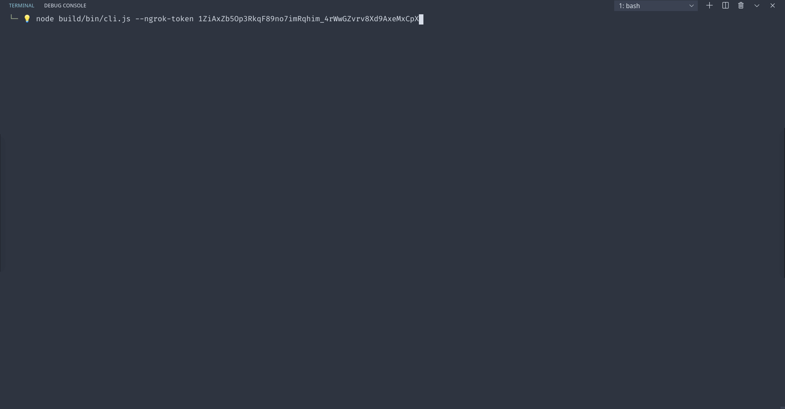
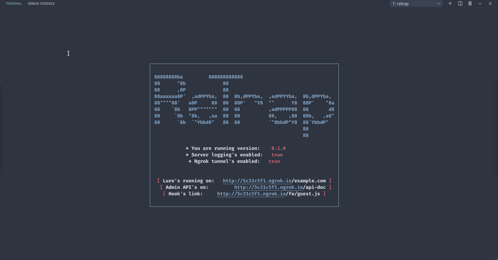
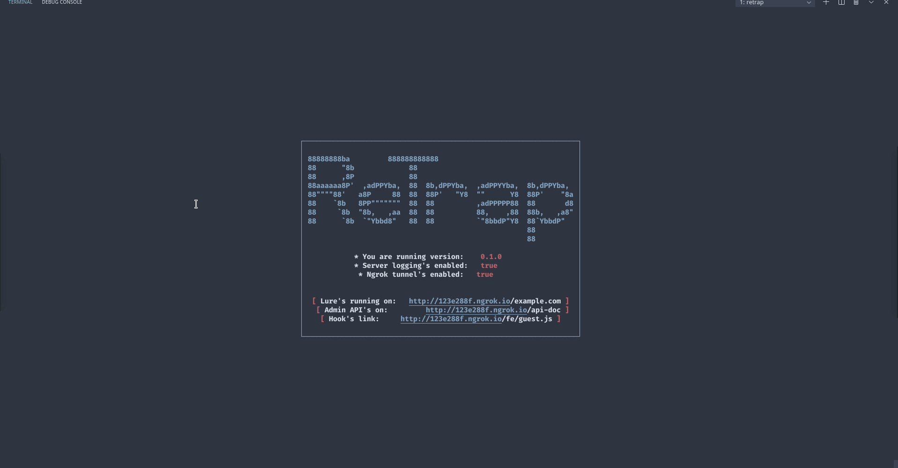
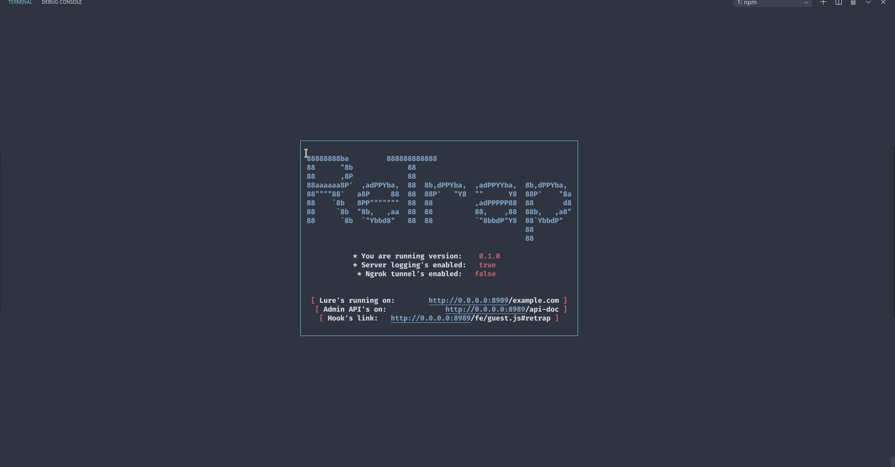
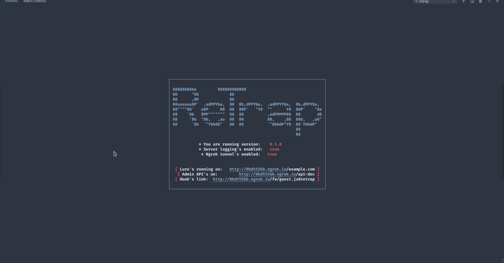

<b>
<pre align='center'>
┌─────────────────────────────────────────────────────────────────┐
│                                                                 │
│ 88888888ba         888888888888                                 │
│ 88      "8b             88                                      │
│ 88      ,8P             88                                      │
│ 88aaaaaa8P'  ,adPPYba,  88  8b,dPPYba,  ,adPPYYba,  8b,dPPYba,  │
│ 88""""88'   a8P     88  88  88P'   "Y8  ""      Y8  88P'    "8a │
│ 88    `8b   8PP"""""""  88  88          ,adPPPPP88  88       d8 │
│ 88     `8b  "8b,   ,aa  88  88          88,    ,88  88b,   ,a8" │
│ 88      `8b  `"Ybbd8"   88  88          `"8bbdP"Y8  88`YbbdP"   │
│                                                     88          │
│                                                     88          │
│                                                                 │
└─────────────────────────────────────────────────────────────────┘
<h5>
    <i><a href='https://en.wikipedia.org/wiki/Open-source_intelligence'>(OSINT)</a></i> Open-Source intelligence tracking and analysis tool. Inspired by <a href='https://github.com/jofpin/trape'>Trape</a>.
</h5>
</pre>
</b>

<br />
<p align='center'>
    <a href='https://github.com/mrf345/retrap/actions' target='_blank' style='margin-right: 2%'>
        
    </a>
    <a href='https://coveralls.io/github/mrf345/retrap?branch=master'>
        
    </a>
    <a href='https://github.com/mrf345/retrap/releases'>
        
    </a>
</p>
<br />

### Setup 🧰
##### - With docker:
- Make sure [docker](https://www.docker.com/products/docker-desktop) and [docker-compose](https://docs.docker.com/compose/install/) is installed on your system.
- And run it with `docker-compose up` after the setup is complete, it should be running on http://0.0.0.0:8989

##### - With executable:
You can find an executable that supports your OS from the following links:

- [Github](https://github.com/mrf345/retrap/releases)
- [Sourceforge](https://sourceforge/retrap)

##### - From the source _(Tested only on Linux)_:
- Install dependencies `npm i .`
- Build assets and compile TypeScript `npm run build`
- Start the server `npm start`
- Package it into binaries `npm run pkg`


### Options 📖
```bash

  Open-Source intelligence OSINT tracking and analysis tool.

  Usage

      $ retrap [option]

  Options

      --ip-address, -i IP address to stream server on        (0.0.0.0)
      --port, -p Port to stream server through               (8989)
      --logging, -o Display http requests logs               (true)
      --ngrok-token -a Ngrok account authentication token

  Example

      $ retrap --port 8080 -l

```

### Features and Demos ✨
##### - Ngrok tunneling support
Exposes the local server to the internet with Ngrok secure tunnel. Get a free token from [Ngrok](https://ngrok.com/product) and use it as shown in the demo.
The authentication token can be persistent and save as a default in `./collections/settings.db` file with `"ngrokAuthToken": "your token"`.

<details>
    <summary> Demo: </summary>
    
</details>


##### - Captures user's information and active sessions
IP address, location, languages, battery left, internet speed... Pluse detecting and storing the active login sessions for facebook, gmail, instagram... 
The captured user's data are stored locally and can be accessed via:

- `http://0.0.0.0:8989/api/guests/` an API endpoint that returns information of all the captured users.
- `http://0.0.0.0:8989/api-docs` has a full documentation of the returned user's details and active sessions.

<details>
    <summary> Demo: </summary>
    
</details>

<details>
    <summary> List of all captured information: </summary>

    ```yaml
        Guest:
          type: object
          properties:
            ip:
              type: string
              description: guest's registered IP address
            online:
              type: boolean
              description: guest's current web session status
            sessionId:
              type: string
              description: guest's socket.io session's id
            os:
              type: string
              description: guest's detected operating system
            browser:
              type: string
              description: guest's detected web browser
            browserEngine:
              type: string
              description: guest's detected browser's engine
            cpuArch:
              type: string
              description: guest's detected CPU's architecture
            charging:
              type: boolean
              description: guest's detected battery charging status
            chargeLeft:
              type: string
              description: guest's detect battery charge left in percentage
            doNotTrack:
              type: string
              description: guest's browser "Do Not Track" status
            java:
              type: boolean
              description: guest's browser Java support
            flash:
              type: boolean
              description: guest's browser Flash support
            language:
              type: string
              description: guest's browser default language
            languages:
              type: array
              description: guest's browser supported languages
              items:
                type: string
            touch:
              type: boolean
              description: guest's device support for touchscreen
            usbDevices:
              type: array
              description: guest's connected USB devices
              items:
                type: string
            resolution:
              type: string
              description: guest's detected screen resolution
            posts:
              type: array
              description: logs of guest's performed POST requests
              items:
                $ref: '#/definitions/Post'
            logs:
              type: array
              description: logs of guest's perform GET requests
              items:
                type: string
            screenshots:
              type: array
              description: guest's captured screenshots in Base64 format
              items:
                type: string
            keyLogs:
              type: array
              description: guest's captured key logs
              items:
                $ref: '#/definitions/KeyLog'
            sessions:
              description: guest's social media and websites active sessions
              $ref: '#/definitions/Sessions'
            country:
              type: string
              description: guest's detected country
            countryCode:
              type: string
              description: guest's detected country-code
            regionName:
              type: string
              description: guest's detected region
            city:
              type: string
              description: guest's detected city
            zip:
              type: string
              description: guest's detected zip code
            lat:
              type: number
              description: guest's detected location latitude
            lon:
              type: number
              description: guest's detected location longitude
            timezone:
              type: string
              description: guest's detected timezone
            isp:
              type: string
              description: guest's detected internet service provider
            networkSpeed:
              description: guest's detected internet speed
              $ref: '#/definitions/NetworkSpeed'
    ```
</details>


##### - Realtime hooks to intercept user's active session
Injecting JavaScript, sending alerts, text-to-speech notifications and redirecting to different locations...
In the following example a `console.log()` is injected:

<details>
    <summary> Demo: </summary>
    
</details>


##### - Hooking script to integrate with your custom webpages
The same hooking script that's used to control the mirrored web sessions, can be used externally within any `.html` or `.js` files.

<details>
    <summary> Demo: </summary>
    
</details>


##### - RESTFul API to execute hooks, query users and integrate with other platforms

<details>
    <summary> Demo: </summary>
    
</details>


### Disclaimer and Background ❎
This tool is experimental in its *Alpha* phase. It's developed and published as a small building block of a master's thesis research.
So use it for *educational purposes* only and at your own discretion, the author cannot be held responsible for any damages caused.

##### - How to protect yourself ?
The tool relays on injecting the any web resources with a JavaScript hook script that allows us to perform verity of intrusive actions remotely.
There many useful browser extensions and plugins that detect and block such intrusive scripts:

- [uBlock Origin](https://github.com/gorhill/uBlock)
- [Privacy Badger](https://privacybadger.org/)
- [NoScript](https://noscript.net/)
- [Brave Browser](https://brave.com/)


### TODO ✅:
- [ ] Fix up the docker containers setup
- [ ] Add token based authorization to the Admin REST API
- [ ] Add `Settings` model CRUD endpoints to Admin REST API
- [ ] Add an admin user-interface based on the REST API and/or Socket.io client. _(Preferably in React/Vue)_
- [ ] Improve hook's `getScreenshot` and add it to the Sockets and REST API
- [ ] Maybe add a push notification hook 🤔 _(Needs research)_
- [ ] Add more integration tests and increase coverage
